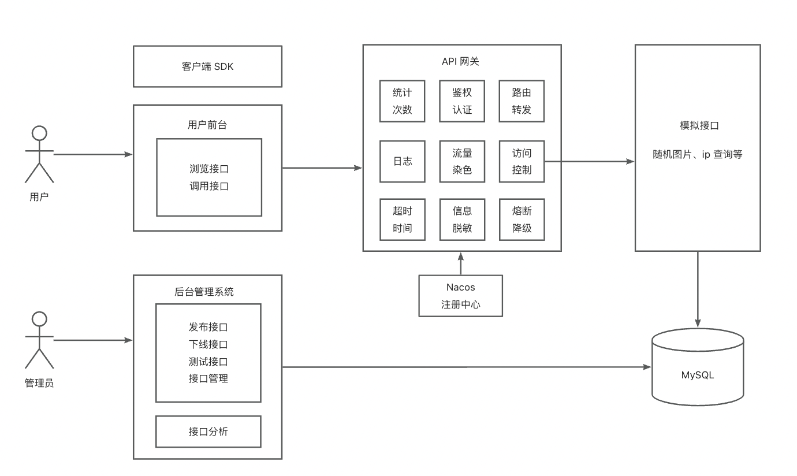

# API 接口开放平台

## **项目简介**

- 一个提供 API 接口供开发者调用的平台。
- 用户可以注册登录，开通接口调用权限。用户可以浏览接口并调用，且每次调用会进行统计。
- 管理员可以发布接口、下线接口、接入接口，以及可视化接口的调用情况、数据。

> 此项目是前后端分离项目，在此仅做后端介绍
>
> 在线访问地址：http://62.234.8.36/
>
> （用户名：admin、密码：admin123456）

## 技术选型

### 后端技术栈

- Spring Boot ：基于之前的模版
- MyBatis-Plus：配合 MyBatis X 使用，提高开发效率
- MySQL：关系数据库
- Redis：数据缓存、提供查询效率
- Nacos：注册中心
- Dubbo：基于 RPC 实现（像调用本地方法一样调用远程方法）
- Spring Cloud Gateway：微服务网关

## 架构设计与模块划分

### 系统架构

### 模块划分

总共包含了 web模块、API 网关模块、模拟接口模块、公共模块、客户端 SDK 模块

- Web（api-backend）：主要用于接收前端的请求，并处理与数据库相关的操作
- API 网关（api-gateway）：用于路由转发、统一鉴权、访问控制、流量染色、跨域处理、统一日志、**统一业务处理**
- 模拟接口（api-interface）：提供可供调用的接口
- 公共模块（api-common）：封装公共使用的类，减少重复代码
- 客户端 SDK（api-client-sdk）：提供给开发者调用，简洁开发

## 项目成果

### 首页

- 查看所有接口

### 接口详情与在线调用

- 根据请求参数去调用

  - 示例 1：

  ​	

  - 示例 2：当请求参数为null，在线测试处可以为空

  ​	

### 接口管理

### 接口分析

Tips：用户要根据 ak / sk 去调用接口

## 快速启动

1. 修改 yml 中的配置

2. 启动 Nacos 注册中心

3. 启动 backend 模块 -> gateway模块 -> interface 模块

   

